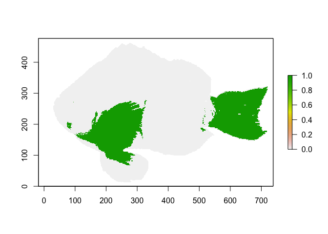
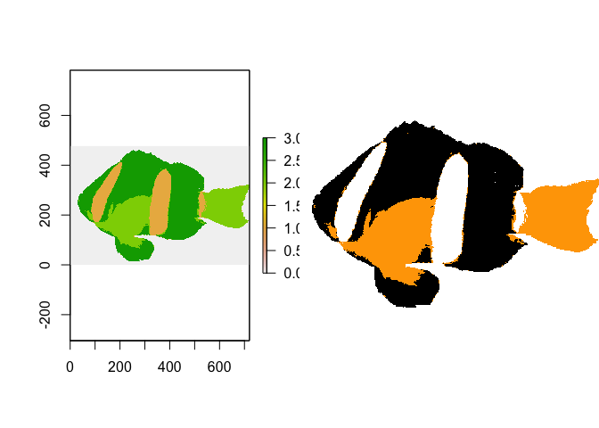
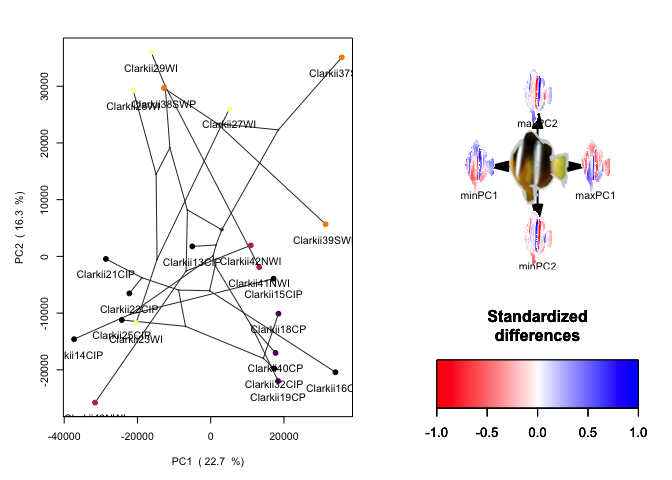

<!-- README.md is generated from README.Rmd. Please edit that file -->

# ColorAR

<!-- badges: start -->

[](https://travis-ci.com/agarciaEE/ColorAR)
[](https://ci.appveyor.com/project/agarciaEE/ColorAR)
[](https://app.codecov.io/gh/agarciaEE/ColorAR?branch=main)
<!-- badges: end -->

The goal of ColorAR is to provide a set of functions to compute
coloration metrics from images and perform comparative analyses.

## Installation

You can install the development version of ColorAR like so:

``` r
library(devtools)
install::github("agarciaEE/ColorAR")
```

## Example

This is a basic example which shows you some functions:

``` r
# load package
library(ColorAR)

# get data
data("imgTransList")
```

Compute color proportion of an image:

``` r
targetColor <- c(255, 165, 0) #orange RGB code

Orange_proportion <- extractColor(imgTransList[[1]], targetColor)
#> Warning in colOffset(image, RGB): Target colour outside colour candidates
#> 3 color candidates...
#> Most proximal candidate colour is:
#> 255 246 255

print(Orange_proportion$P) # print proportion
#> [1] 0.2704314
plot(Orange_proportion$ras) # plot color distribution on the image
```



Classify image based on target colors:

``` r
# define a data frame with the target colors RGB codes.
targetColors = data.frame(red = c(255, 255, 0),
                 green = c(255, 165, 0),
                 blue = c(255, 0, 0),
                 row.names = c("white", "orange", "black"))
  
imgClass <- classifyColor(imgTransList[[1]], RGB = targetColors, allow.admixture = F, output = "both")
#> Computing colors' offsets...
#> Target colour within colour candidates
#> Warning in colOffset(image, x): Target colour outside colour candidates
#> 3 color candidates...
#> Most proximal candidate colour is:
#> 255 246 255
#> Target colour within colour candidates
#> Selected offsets:
#>     white    orange     black 
#> 0.3231898 0.3234802 0.3537182
#> Classifying image...
#> Admixture of target colors present...
#> Done

par(mfrow = c(1,2))
plot(imgClass$class) # plot classified image
plotRGB(imgClass$RGB) # plot classified image in RGB format
```



Perform PCA on images:

``` r

## basic example code
imgPCA12 <-  imagePCA(imgTransList, PCx = 1, PCy = 2, scale = F, plot.eigen = F, plot.PCA = F,interpolate = 5, plot.names = F, plot.images = F, plot.tree = NULL, type = "RGB" , as.RGB = F)
```

Plot image PCA along with a tree:

``` r
regcols <- setNames(rep(viridis::inferno(5))[as.factor(dataset$region)], dataset$sample)

imagePCA.plot(imgPCA12, tree = tree, plot.tree = "integrated", plot.images = F, colPCA = regcols, coltree = regcols)
```


